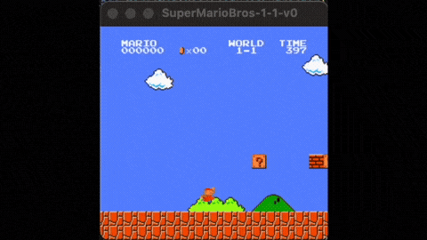

# Mario PPO Agent (Super Mario Bros 1-1)


Proyecto de aprendizaje por refuerzo que entrena un agente con **PPO (Proximal Policy Optimization)** para jugar **Super Mario Bros 1-1** usando `gym-super-mario-bros` y `stable-baselines3`.





🎥 **Video completo del agente jugando:**  
[https://youtu.be/G2IWO-ttQWU
(https://youtu.be/G2IWO-ttQWU?si=51PdL5CmNTxr2rNI)](https://youtu.be/G2IWO-ttQWU)

---

## 🎯 Objetivo
Entrenar y evaluar un agente capaz de avanzar de forma consistente en el nivel 1-1, maximizando recompensa mediante una política CNN y una función de recompensa personalizada.

## 🧠 Enfoque técnico
- Algoritmo: **PPO** (`stable-baselines3`)
- Observaciones:
  - Escala de grises
  - Redimensionado a `84x84`
  - Apilado de `4` frames
- Wrappers personalizados:
  - `SkipFrame` (repetición de acción)
  - `ResizeEnv`
  - `CustomRewardAndDoneEnv` (reward shaping por progreso en `x_pos`, bonus por bandera y penalización por muerte)
- Dispositivo: **MPS** (Apple Silicon) si está disponible, si no CPU.

## 🗂️ Estructura del proyecto
- `trainNotebook.py`: entrenamiento PPO + callback de evaluación periódica
- `runNotebook2.py`: evaluación visual del modelo entrenado
- `graph.py`: visualización de métricas de entrenamiento
- `model/`: artefactos de modelo y métricas (`reward_log.csv`, checkpoints)
- `logs/`: logs de entrenamiento

## ⚙️ Requisitos
- Python 3.8+
- Entorno virtual recomendado
- Dependencias principales:
  - `gym`
  - `gym-super-mario-bros`
  - `nes-py`
  - `stable-baselines3`
  - `torch`
  - `opencv-python`
  - `numpy`
  - `matplotlib`
  - `tqdm`

## 🚀 Instalación rápida
```bash
python3 -m venv env
source env/bin/activate
pip install --upgrade pip
pip install -r requirements.txt
```

## 🏋️ Entrenamiento
```bash
python trainNotebook.py
```

Salida esperada:
- Checkpoints periódicos en `model/`
- Modelo final en `model/ppo_mario_final.zip`
- Registro de recompensas en `model/reward_log.csv`

## 🎮 Evaluación / Demo
```bash
python runNotebook2.py
```

## 📈 Visualización de resultados
```bash
python graph.py
```

## ⚙️ Cómo funciona el agente

El agente utiliza una política convolucional entrenada con PPO que observa el estado del juego a través de frames preprocesados.

El pipeline de entrenamiento incluye:

1. Preprocesamiento de imágenes del entorno
2. Apilado temporal de frames
3. Reward shaping basado en progreso horizontal
4. Entrenamiento PPO con Stable-Baselines3
5. Evaluación periódica mediante callbacks

Este enfoque permite estabilizar el entrenamiento y guiar al agente hacia comportamientos útiles dentro del entorno.

## 📊 Resultados

Resultados obtenidos durante el entrenamiento del agente:

- Timesteps totales de entrenamiento: **5,000,000**
- Recompensa promedio alcanzada: **> 800**
- Mejor recompensa observada (evaluación final): **986.9**
- Bandera alcanzada (`flag_get`): **Sí — el agente completa el nivel 1-1 de forma consistente**

Durante el entrenamiento el agente mostró una curva de aprendizaje estable, incrementando progresivamente la recompensa a medida que aprendía a avanzar en el nivel.  
El uso de preprocesamiento de imágenes, frame stacking y reward shaping permitió mejorar la estabilidad del entrenamiento y guiar al agente hacia comportamientos efectivos como anticipar tuberías, evitar enemigos y ejecutar saltos precisos.


## 🧪 Reproducibilidad
Para mejorar reproducibilidad en una versión futura:
- Fijar seeds (`numpy`, `torch`, entorno)
- Versionar dependencias con `requirements.txt`
- Registrar hardware y tiempo total de entrenamiento

## ⚠️ Limitaciones actuales
- Entrenamiento centrado en un solo nivel (`SuperMarioBros-1-1-v0`)
- Reward shaping específico de ese nivel
- No incluye benchmark formal contra baseline aleatorio en el README

## 🛣️ Trabajo futuro
- Entrenar en múltiples niveles y generalización
- Evaluación determinista vs estocástica
- Comparación PPO vs otros algoritmos (A2C / DQN)
- Pipeline automático de métricas y reportes

## 👤 Autor
Nicolás Riveros

Si usas este repositorio como base, cita el proyecto y mantén trazabilidad de cambios experimentales.
